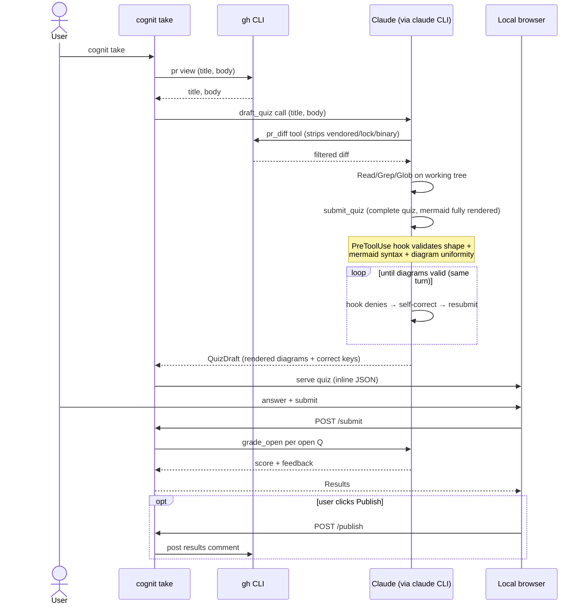

# cognit

**Comprehension-driven development** — Claude reads your PR and quizzes you on it.

[](https://pypi.org/project/cognit/)
[](https://pypi.org/project/cognit/)
[](https://github.com/jonasbrami/cognit/actions/workflows/ci.yml)
[](LICENSE)

> Voluntary, opt-in PR-author comprehension quizzes. Surface the gap between what you think your code does and what it actually does — before you merge.


**cognit flips the usual AI coding loop.** Normally you write a prompt and Claude writes the code. cognit has Claude *read* the code and write prompts back — questions only you, the author, can answer about the diff you're about to merge. Same model, arrows reversed, and the loop closes on the one question that matters: *does this code do what you intended?* Each question you wrestle with — especially the ones you get wrong — is comprehension credit banked against [comprehension debt](#why-this-exists). Call it **comprehension-driven development (CDD)**.

It's a local CLI that quizzes the **author** of a pull request — not the reviewer — on the code they're about to merge. One command, runs locally, results stay on your machine unless you explicitly publish them to the PR.

## TL;DR

- `cognit take` — auto-detects the PR for your current branch, generates a quiz from the diff via Claude, opens it in your browser, grades in-session.
- **Nothing is posted to GitHub** unless you click **Publish results to PR**. The quiz itself is never published; only a results comment, only if you ask.
- Like CI checks or pre-commit hooks: opt-in. Failing doesn't gate anything — the value is the "aha" when you realize the code does something you didn't expect.
- Anthropic-only for now. Requires a Claude Code OAuth session via `claude login` — no API-key path.

## Quickstart

### Prerequisites

| Tool | Required? | Why |
|---|---|---|
| Python **≥3.12** | required | runtime |
| [`gh`](https://cli.github.com/) (logged in via `gh auth login`) | required | PR detection, diff fetch, comment publish |
| `git` | required | working-tree access so the agent can read changed files |
| A web browser | required | the quiz UI runs at `http://127.0.0.1:<random-port>` |
| [`claude`](https://docs.claude.com/en/docs/claude-code/overview) CLI (logged in via `claude login`) | required | inference path — all model calls run through it |
| [`@mermaid-js/mermaid-cli`](https://github.com/mermaid-js/mermaid-cli) (`mmdc`) | optional | fastest path for server-side mermaid validation. If absent, `cognit` falls back to a lazily-built Docker parse-only image, then to a Python regex backstop — see [Mermaid validation](#mermaid-validation). |

### Install

```bash
# pick one:
uv tool install cognit
pipx install cognit
```

> Want the latest unreleased changes? Install from source instead:
> `uv tool install git+https://github.com/jonasbrami/cognit.git`

### Authenticate

**Claude Code OAuth (zero config).** Run `claude login` once. `cognit` reads `~/.claude/.credentials.json` automatically. Billed to your Claude Code subscription.

### Run it

```bash
# from a checkout of your PR branch:
cognit take
```

That's it. The CLI:

1. Detects the PR for the current branch via `gh`.
2. Generates a quiz from the diff (or loads it from the local cache at `$TMPDIR/cognit/` if you've already generated one for this PR).
3. Opens your browser to the quiz.
4. Grades everything in-session when you hit Submit — MCQ / mermaid / true-false deterministically; open questions are LLM-graded against a rubric the generator wrote.
5. Shows you results. Click **Publish results to PR** if you want a record on GitHub; otherwise nothing leaves your laptop.


## How it works



The LLM picks question count and type mix based on diff complexity — typically 2–10 questions across MCQ, mermaid-pick, open, and true/false. To suppress quiz generation on a specific PR, include `quiz: skip` in the PR description.

> 0.1.0 ships as a local CLI only. A GitHub Actions wrapper that would auto-trigger the quiz on PR open is **not on the roadmap** — see [`ROADMAP.md`](ROADMAP.md).

### Security model and inference routing

All model calls route through the `claude` binary via the Claude Agent SDK — not the Anthropic Python SDK directly. This is load-bearing for three reasons:

1. **Model access.** The direct Anthropic SDK with an OAuth token is gated to Haiku. Routing through the `claude` binary is what lets Claude Code OAuth and Max subscribers reach Sonnet and Opus.
2. **Safety boundary.** The generation agent runs under `bypassPermissions`, which auto-runs every *available* tool without prompting. The real gate is the `tools=` parameter, which controls *availability* — not the allow-list (which only suppresses prompts). For generation, the available built-ins are `Read`, `Grep`, `Glob` only: no `Bash`, no `Write`, no `Edit`, so the agent can't shell out or mutate the working tree. (Why not a restricted-git Bash? `tools=` is coarse — you get the whole shell or none — and `git` is an RCE surface via config, external-diff drivers, and aliases. The `file_diff` MCP tool exposes one fixed `subprocess.run` argv instead.)
3. **Read confinement.** A `PreToolUse` hook resolves every `Read`/`Grep`/`Glob` path against the repo root and denies traversals (`../`, absolute paths), so a prompt-injected PR body can't coax the agent into reading `~/.ssh/id_rsa`.

**Cost note.** The `total_cost_usd` logged at the end of a run is an *estimate* from token counts — what a pay-as-you-go API key would bill. Max-plan subscribers are not charged per call.

## Why this exists

There's a name for the problem this tool exists to address: **comprehension debt**. As Addy Osmani puts it:

> Comprehension debt is the growing gap between how much code exists in your system and how much of it any human being genuinely understands. Unlike technical debt, which announces itself through mounting friction […] comprehension debt breeds false confidence.[^1]

The risk isn't bad code per se; it's confidence in code that looks reasonable but does something subtly different from what the author thinks. AI accelerates this mechanically — in Anthropic's own skill-formation study, "the AI group averaged 50% on the quiz, compared to 67% in the hand-coding group."[^2] Simon Willison describes the same drift from the inside: "I no longer have a firm mental model of what they can do and how they work, which means each additional feature becomes harder to reason about."[^3] Margaret-Anne Storey traces this further back to teams losing the *theory* of their own system — by week seven of one project she studied, "no one on the team could explain *why* certain design decisions had been made or *how* different parts of the system were supposed to work together."[^4]

Anyone shipping with AI has been there: you "review" a diff in ten minutes, nod through code that *looks* right, then realize a week later you can't explain why a particular line is there. **Reviewing LLM-generated code properly — actually understanding it, not just skimming — costs about as much time as writing it yourself.** Most of us skip that cost and pay the interest later. And skipping it doesn't remove the responsibility: **the code, not the prompt, is what runs in production.** Computers don't read your mind; humans, not models, are responsible for what they ship.

We've all felt this outside software too. You think you understand a topic — until the exam asks you something specific, and the gap shows up the moment you reach for the answer. **You only really learn it by being tested on it.**

That's what `cognit` does, for code you're about to merge. The quiz is the diagnostic; the explanation of the right answer is the medicine. Human attention is precious — the north star is to use LLMs to *illuminate areas of non-comprehension* so the time you spend reading your own PR lands on what actually needs a human mind.

> Coding with AI: *human writes prompt → LLM writes code.*
> CDD: *LLM reads code → LLM writes prompts the human answers.*

Comprehension-driven development means a change isn't done until the author has been examined on it. The LLM is the examiner; the human stays in the loop where it matters — building the mental model.

*(Future: the author picks which areas of the diff to be examined on and at what depth — not in this release.)*

## Reference

### Configuration

```bash
cognit take [--pr URL] [--model NAME] [--show-results]
```

| Flag | Default | Description |
|---|---|---|
| `--pr` | auto-detect from current branch | PR URL or number. |
| `--model` | `claude-sonnet-4-6` | Anthropic model name. |
| `--show-results` | off | Print the latest results comment as JSON instead of opening the browser. |

**Rate limits** follow your Claude Code subscription limits.

### Mermaid validation

The generator produces mermaid-pick questions (four diagrams, one correct). Before a quiz is served, every diagram is validated server-side so a malformed diagram never reaches the browser. `cognit` tries three layers, in order of preference:

1. **`mmdc`** (`npm install -g @mermaid-js/mermaid-cli`) — fastest, no per-call overhead.
2. **Docker** — if `mmdc` is absent but `docker` is available, `cognit` lazily builds a small parse-only validator image on first use (no Chromium; just `mermaid` + `jsdom`).
3. **Python regex backstop** — if neither is present, a lightweight check still runs, catching the most common LLM failure modes (missing diagram header, grossly unbalanced brackets, `[/text]` parallelogram traps).

To trace which layer is chosen (and other internal decisions), set `COGNIT_LOG_LEVEL=DEBUG`:

```bash
COGNIT_LOG_LEVEL=DEBUG cognit take
```

<details>
<summary><strong>Troubleshooting</strong></summary>

| Symptom | Fix |
|---|---|
| `error: no PR detected from current branch` | Push the branch and open a PR, or pass `--pr <url>`. |
| `Your Claude Code OAuth session is expired` | `claude login` to refresh. |
| `claude` binary not found / not on PATH | Install Claude Code and run `claude login`. |
| `gh` errors out | `gh auth status` to check, `gh auth login` to (re-)authenticate. |
| Browser doesn't open / port collision | The CLI picks a random free port and `webbrowser.open`s it. If your environment is headless, copy the `http://127.0.0.1:<port>` URL from the CLI output. |
| Want to regenerate after a cached quiz | The cache lives at `$TMPDIR/cognit/<digest>.json` — delete that file and run `cognit take` again. |

</details>

## Status

**0.1.0 (first release):**

- A single CLI command: `cognit take`. Generates the quiz on first run, opens the browser, grades in-session, opt-in publish.
- 4 question types (MCQ, mermaid-pick with auto-neutralized A/B/C/D labels, open, true/false).
- Anthropic adapter via tool use (guaranteed-schema output), OAuth via the `claude` CLI.
- Local FastAPI server with embedded HTML/JS/CSS + a vendored `mermaid.js` UMD bundle (no CDN at runtime).

**Future** (see [`ROADMAP.md`](ROADMAP.md)):

- GitHub App (no per-repo workflow file).
- Fleet of LLMs for question diversity.
- Skills integration (team domain knowledge in generation prompts).
- IDE integration.

[^1]: Addy Osmani, ["Comprehension Debt"](https://addyosmani.com/blog/comprehension-debt/).
[^2]: Anthropic, ["How AI Impacts Skill Formation"](https://www.anthropic.com/research/AI-assistance-coding-skills).
[^3]: Simon Willison, ["Cognitive debt"](https://simonwillison.net/2026/Feb/15/cognitive-debt/).
[^4]: Margaret-Anne Storey, ["Cognitive Debt"](https://margaretstorey.com/blog/2026/02/09/cognitive-debt/).

## License

MIT
